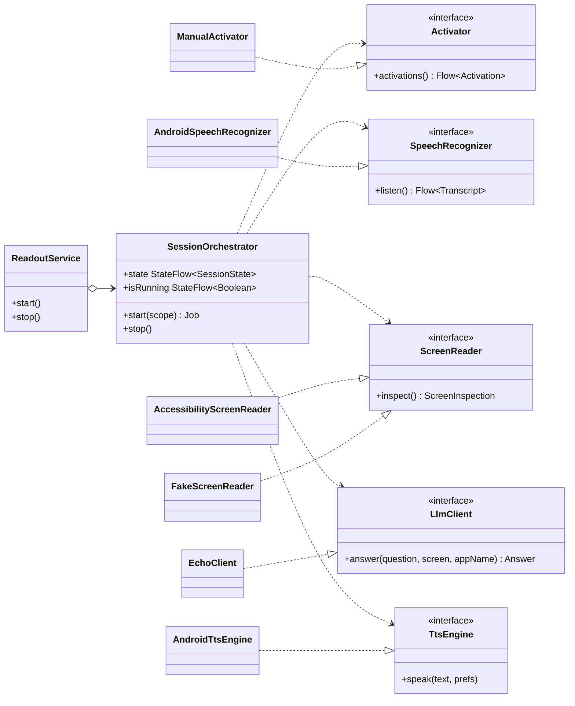

# Readout

[](https://github.com/greg7gkb/readout/actions/workflows/build.yml)

A user-initiated Android app that listens for natural-language voice queries about what's currently on screen, then answers via TTS. Hands-free via wake word; tap-to-talk as an equal-standing alternative.

**Framing:** accessibility tool first. Motor impairment, low vision, and situational disability (hands occupied while cooking, driving, walking, holding a child) are the design center.

## Status

**Phase 1 — Foundations: complete.** A multi-module Hilt-wired skeleton with stub implementations (`EchoClient` LLM, `FakeScreenReader`, no-op wake-word) and real Android implementations of speech recognition and TTS, all driven by a `SessionOrchestrator` running inside a `FOREGROUND_SERVICE_MICROPHONE` foreground service. Validated end-to-end on a Pixel 7 — tap → speak → hear the echoed phrase spoken back.

**Phase 2 — Screen reading via AccessibilityService: complete.** Real `AccessibilityScreenReader` (`:core:screen`) walks the foreground window's view tree on demand via a pure, unit-tested `NodeWalker`. Onboarding deep-links the user into Accessibility Settings as a focused step. A debug-command dispatcher exposes `inspect` (and `ask`) via ADB broadcast, so target-app screens can be dumped without going through the speech pipeline. Phase 3 target (Android Settings) selected with rationale in [`docs/phase3_target.md`](docs/phase3_target.md).

Next up: **Phase 3 — Query-to-answer pipeline.**

See [`docs/plan.md`](docs/plan.md) for the full project plan, phase breakdown, and effort estimates.

## Architecture

Multi-module Gradle, interface-driven, Hilt DI. Every external dependency lives behind an interface in its own module so implementations can be swapped without touching session logic or UI.

```
:app                           Application + DI wiring + foreground service + flavors
:core:common                   Shared models, coroutine dispatchers
:core:audio                    SpeechRecognizer + TtsEngine (Android impls)
:core:screen                   ScreenReader (AccessibilityScreenReader; FakeScreenReader retained as a reference impl)
:core:llm                      LlmClient (EchoClient; cloud + AICore impls in Phase 3)
:core:wake                     WakeWordEngine + Activator (Porcupine in Phase 4)
:core:session                  Pipeline orchestrator — depends only on interfaces
:feature:onboarding            Compose permission + consent flow
:feature:settings              Compose settings UI
```

`:core:session` and `:feature:*` never depend on concrete implementations — only interfaces. Implementations are wired exclusively in `:app`.

`SessionOrchestrator` depends only on the five `:core` interfaces; the foreground service owns it, and concrete implementations plug in via Hilt:



**Build flavors:**
- `dev` — stub implementations (default during prototype)
- `cloud` — cloud LLM backend (wires in Phase 3)
- `onDevice` — AICore Gemini Nano backend (Pixel 10 Pro tier, wires in Phase 3)

## Build & run

Requires JDK 21, Android SDK with API 35 platform + build-tools, an Android device or emulator (Pixel 7 or equivalent with Google Play Services for full STT support).

```bash
./gradlew :app:assembleDevDebug
adb install app/build/outputs/apk/dev/debug/app-dev-debug.apk
adb shell am start -n com.greg7gkb.readout.dev/com.greg7gkb.readout.MainActivity
```

Walk through onboarding to grant microphone + notification permissions, tap **Start session**, then **Trigger activation** and speak a short phrase. With the `dev` flavor's `EchoClient` LLM, the response is the reversed transcript spoken back through the device speaker.

## Debug

The app exposes an ADB-driven debug surface for poking at internals without going through the speech pipeline. Useful while iterating on the screen reader, and for capturing dumps of target apps when designing the Phase 3 LLM prompt.

### Inspect the foreground app

Walks the currently-foregrounded app's accessibility tree and logs the result. The Readout accessibility service must be enabled (post-onboarding) and the dev flavor must be installed.

```bash
adb shell am broadcast \
  -a com.greg7gkb.readout.action.DEBUG_COMMAND \
  --es cmd inspect \
  -p com.greg7gkb.readout.dev
```

As a shell alias (drop into `~/.zshrc` or `~/.bashrc`):

```bash
alias readout-inspect='adb shell am broadcast -a com.greg7gkb.readout.action.DEBUG_COMMAND --es cmd inspect -p com.greg7gkb.readout.dev'
```

Watch the result on a second terminal:

```bash
adb logcat -s Readout/Debug:V Readout/Screen:V
```

If the notification shade is pulled down when an `inspect` (or `ask`) broadcast fires, the screen reader detects SystemUI as the focused window, dismisses the shade, and re-reads — so the dump captures the underlying app rather than the shade itself.

### Ask a question (bypass STT)

Runs the same pipeline as a voice activation but skips the activation and STT steps — useful on emulator (where STT is broken) and for batch-running query variants without re-recording the transcript each time. Inspects the foreground app, calls the configured `LlmClient`, logs the answer, and (by default) speaks it via TTS.

```bash
adb shell "am broadcast \
  -a com.greg7gkb.readout.action.DEBUG_COMMAND \
  --es cmd ask --es q 'what version of Android am I running?' \
  -p com.greg7gkb.readout.cloud"
```

Append `--ez speak false` to suppress TTS. Note the double quotes around the whole `am broadcast …` argument — `adb shell` joins args into one shell command on the device, so a question with spaces needs an outer quote (your shell) and an inner quote (the device shell). Without the outer quote, the question splits at the first space and `-p` ends up parsing as the package value (you'll see `pkg=version` in the broadcast confirmation, then nothing in logcat).

If the accessibility service isn't currently bound to the process, the command fails closed: speaks a deterministic "I can't read the screen — please re-enable accessibility access" message and skips the LLM call entirely.

### Exercise the screen-reader Unavailable path

When validating the Layer 1 fail-closed behavior or the home-screen "Accessibility access is off" banner, you want to flip the screen reader to unavailable *without* force-stopping the app — force-stop puts the package in Android's stopped state, which clears settings on this emulator and routes back through onboarding rather than showing the banner.

The surgical move is to delete the enabled-services setting. The system unbinds our service immediately; our `ReadoutAccessibilityServiceHolder` flips its `StateFlow<…?>` to null; `ScreenReader.availability` emits false; the Compose banner renders live without the app process restarting.

```bash
# Unbind (banner appears live; PID unchanged)
adb shell settings delete secure enabled_accessibility_services

# Restore — replace the suffix to match the installed flavor (.dev / .cloud / .ondevice)
adb shell settings put secure enabled_accessibility_services \
  com.greg7gkb.readout.cloud/com.greg7gkb.readout.screen.ReadoutAccessibilityService
adb shell settings put secure accessibility_enabled 1
```

Don't try `settings put secure enabled_accessibility_services ""` — `adb settings` rejects empty-string values with `Bad arguments`. `delete` is the right verb.

### Adding new debug commands

See `app/src/main/kotlin/com/greg7gkb/readout/debug/DebugCommandDispatcher.kt`. Commands live in a `Map<String, DebugCommand>` — adding one is a single map entry. Invoke with `--es cmd <name>`; future commands can read additional extras off the originating intent.

## Tech stack

Kotlin 2.1 · Android Gradle Plugin 8.7 · Compose Material 3 · Hilt 2.54 · Coroutines · `minSdk 31` / `targetSdk 35`

## License

Licensed under the [Apache License, Version 2.0](LICENSE).

## Contributing

This is a personal prototype, not yet accepting external contributions. Feedback and issues are welcome via the [GitHub issue tracker](https://github.com/greg7gkb/readout/issues).
